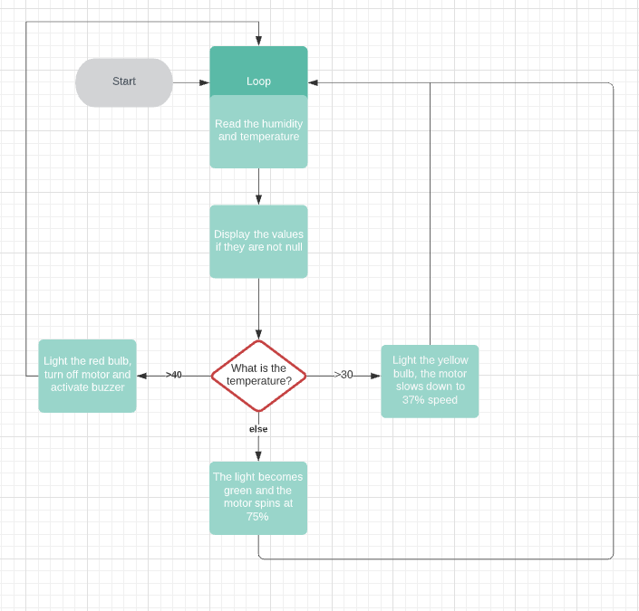
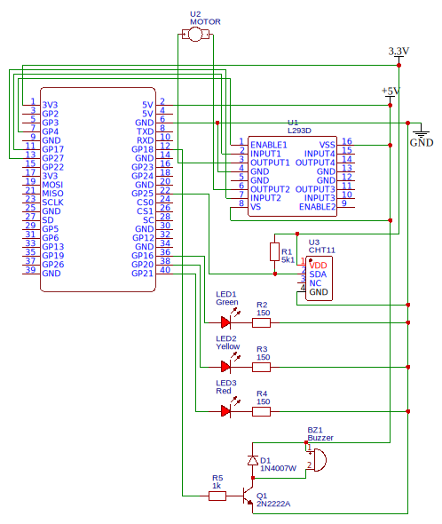
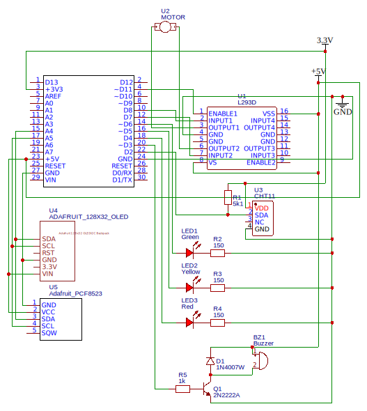
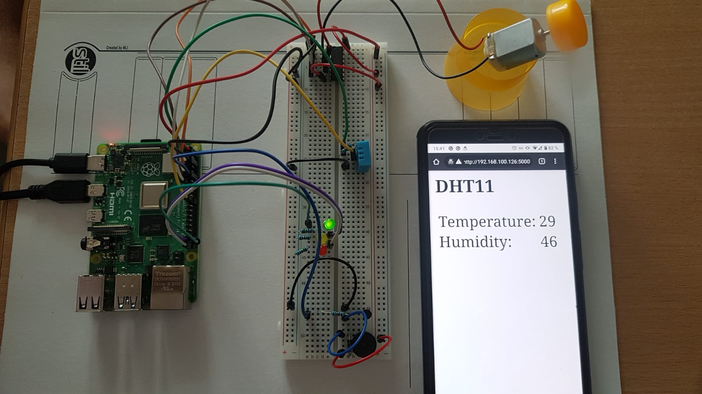
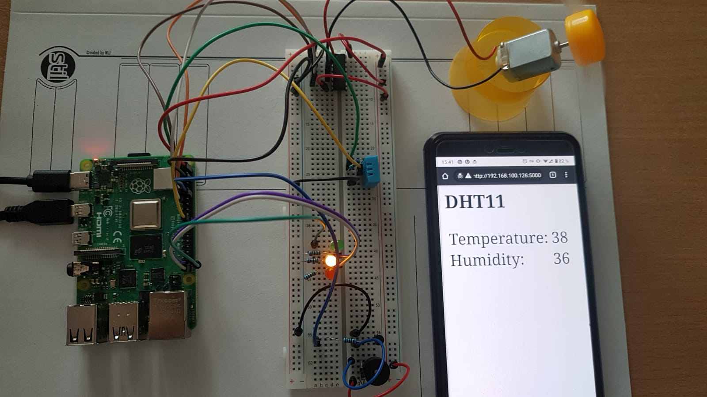
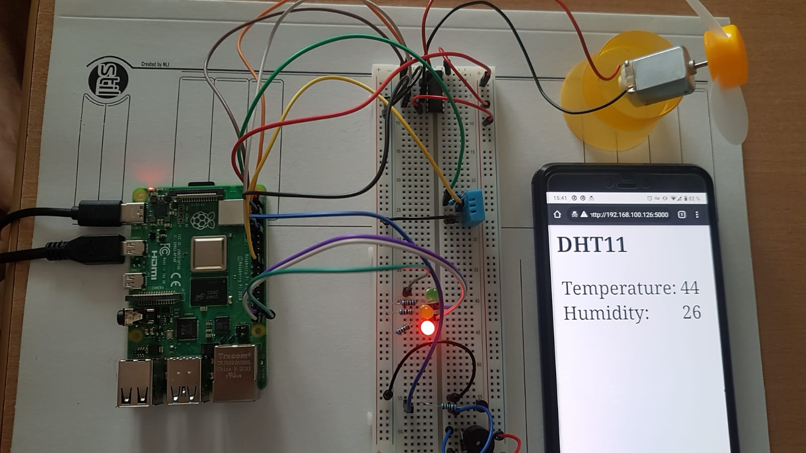
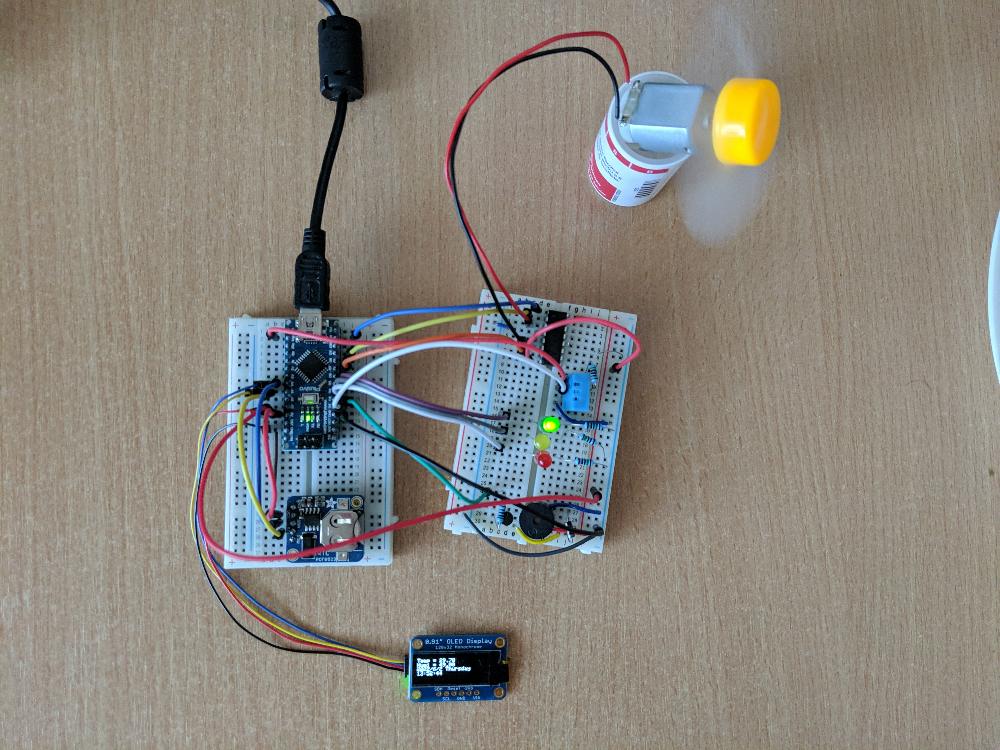

# Data Acquisition

Table of Contents
=================

* [Data Acquisition](#data-acquisition)
   * [0. Repository description](#0-repository-description)
   * [1. Project subject](#1-project-subject)
   * [2. Functionality](#2-functionality)
   * [3. Implementation](#3-implementation)
   * [4. Electrical Parameters](#4-electrical-parameters)
   * [5. Power Consumption](#5-power-consumption)
   * [6. Arduino Nano version](#6-arduino-nano-version)
   * [7. Pictures](#7-pictures)
   * [8. Acknowledgments](#8-acknowledgments)

Created by [gh-md-toc](https://github.com/ekalinin/github-markdown-toc)

## 0. Repository description

This project provides solutions for the homework project for the Data
Acquisition course taught at
[Politehnica University of Bucharest](https://upb.ro), during the second
semester of the university year 2020-2021.

For more information or a syllabus check out the course description
[page here](https://cs.pub.ro/index.php/education/courses/59-under/an2under/118-data-acquisition)
. This course was taught by Dumitru-Cristian Trancă.

## 1. Project subject

The project consists in the implementation of an engine speed control system
depending on the ambient temperature.

## 2. Functionality

The DC motor is connected to the pins exposed by a Raspberry Pi 4B. It uses
Pulse-Width-Modulation to change the engine speed via an H-bridge (L293D).

There is a temperature sensor (DHT11) in the same room as the engine, and
depending on the value read from the sensor, one of the following actions will
be performed:

- A green LED will light up
- A yellow LED will light up a buzzer sound will be heard
- A red LED will light up and buzzer sound will be heard continuously

A server using [Bottle](https://bottlepy.org/docs/dev/) is running on the
Raspberry Pi. This will allow any device connected to the local network to see
in the browser (which should support JavaScript) the temperature in the engine
room.

## 3. Implementation

| Component | Datsheet |
|-|-|
|Raspberry Pi 4B|https://datasheets.raspberrypi.org/rpi4/raspberry-pi-4-product-brief.pdf|
|BCM2711|https://datasheets.raspberrypi.org/bcm2711/bcm2711-peripherals.pdf|
|L293D|https://www.ti.com/lit/ds/symlink/l293d.pdf|
|MM10 motor|http://www.farnell.com/datasheets/2826303.pdf|
|2N2222|https://components101.com/asset/sites/default/files/component_datasheet/|2N2222%20NPN-transistor%20datasheet.PDF
|Buzzer|Generic component|
|DHT11|https://media.digikey.com/pdf/Data%20Sheets/Adafruit%20PDFs/DHT11_Humidity_TempSensor.pdf|
|Resistors|Generic component|
|Cabels|Generic component|
|LEDs|Generic component|
|Breadboard HQ 830p|MB-102 Color Solderless Breadboard|

The motor and buzzer are powered at 5V, directly from the power pin of the
microcontroller. However the control and reading is done through the GPIO pins,
which work at 3.3V. That's why I powered the temperature sensor from 3.3V so as
not to send an overvoltage to the reading.

The code can be read the files [controlling_a_motor.py](controlling_a_motor.py)
and [index.html](index.html). I used chunks of code already included in the
Plusivo electronics kit, especially on the server side, but the logic in the
Python script belongs entirely to me. I used the `pigpio` libraries,
`Adafruit_DHT`, to interface the buzzer and the temperature sensor.

## 4. Electrical Parameters

RPi4 supply voltages:

|Symbol|Parameter|Minimum|Maximum|
|-|-|-|-|
|VIN (V)|5|-0.5|6|
|VGPIO (V)|GPIO Input Voltage|-0.5|3.6|

Raspberry Pi 4 implements Dynamic Voltage and Frequency Scaling. The working frequency can be one of: 1500MHz, 1000MHz, 750MHz and 600MHz.

Energetic consumption for RPi4 (considering that I could not find all the
electrical parameters in the datasheets above, I consulted the
[datasheet](https://datasheets.raspberrypi.org/cm4/cm4-datasheet.pdf) of
Raspberry Pi Compute Module 4)

|State|Current|Power|
|-|-|-|
|Shutdown|15μA|75μW|
|Idle|400mA|2W|
|Load|1.4A|7W|

Electrical parameters of the temperature sensor (25 °C):

|Parametru|Condiții|Valoare|
|-|-|-|
|VDD|DC|5V (min. 3 și max 5.5)|
|IIN|Measuring|0.5mA – 2.5mA|
|IIN|Average|0.2mA – 1mA|
|IIN|Standby|100µA – 150µA|
|Sampling period|None|1s|

## 5. Power Consumption

The temperature sensor consumes 150µA, 0.5mW for 4 seconds, and for one second
of the rest of the 5s period, it consumes 2.5mA, 8.25mW. So on average 1mA,
3.3mW.

The motor consumes a maximum of 1.23W and because we use it at a maximum speed
of 75% then we will consider only 922mW. Since the buzzer is on when the engine
is slowed down, we will neglect the buzzers consumption. Given that the
transistor has a leakage current of the order of pA, we will consider its
consumption negligible. For the L293D chip we will increase its consumption to
20mA.

In the worst case on any of the display LEDs we have 8.7mA, so 28.6mW.

Given that RPi does not perform intensive tasks, and the operating system knows
how to optimize its consumption, we will consider a consumption of 600mA, 3W,
guided by the
[experiments](https://www.hackster.io/rob-lauer/optimizing-a-raspberry-pi-for-off-grid-power-consumption-22cec6)
performed by the enthusiasts, and not by Absolute Maximum Ratings.

So we have a total consumption of 815mA, 4.1W.

In order to run the system on batteries we will need 6 batteries of 1.2V, 7.2V
in total, because of the voltage stabilizer we can not use a voltage very close
to 5V. In this configuration the system would work correctly for about
three hours.

In order to reduce the energy consumption of the system, we could make rarer measurements of the ambient temperature. Since the readings from the sensor, respectively the state changes, are made according to the second parameter of
the call `setInterval(refreshFunction, 5000)`, from line 30, from `index.html`.
Currently the refresh interval is set to 5 seconds, but we can increase it to 5
minutes, because a faster rise of 10° C in 5 minutes would mean an explosion.
Entering sleep sequences is unnecessary because the bottle framework runs on
threads.

Also, for this application you can disable controllers of USB and HDMI ports ...
(and disable any other component on the SoC that does not help us in this
project). Personally, I don't see the use of underclocking, because the OS
already takes care of that.

## 6. Arduino Nano version

In the folder [nano][./nano]  you can find a version of this project made using
a Arduino Nano. The only components not mentioned used are a
[OLED screen](https://adafru.it/4440) and a
[Real-Time Clock](https://adafru.it/3295).

## 7. Pictures

Green state:

Yellow state:

Red state:

Arduino Nano version:

## 8. Acknowledgments

I would like to thank Dumitru-Cristian Trancă for the time he put in explaining 
to me electronics and physics. I would also like to thank my teaching assisnt,
Alexandru-Viorel Pălăcean for all his support.
